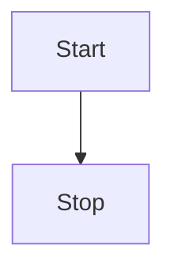
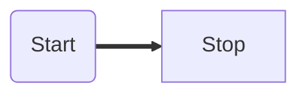
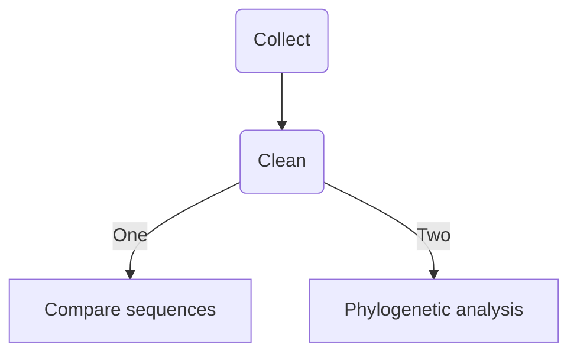

# Headers


# Header

## header

### header

#### header

##### header

###### header


# Unordered list

* unordered lists
* underordered lists
  * subset unordered list


# Manual line break


###### ^that was a manual line break

# Links

<https://lvash.github.io/Bio381/>

[a very useful website][https://lvash.github.io/Bio381/]


# Images


# Block quotes

> In this first paragraph, it should be noted that Blockquote is a 10 letter word. 
>
> >I did another sideways carat for fun. I wonder if you can make a rainbow? 
>
> This is another, second paragraph just for the heck of it. 


> I separated out the blockquote just now, using the enter button multiple times to exit from each block quote. 


> o 
>
> > o
> >
> > > o
> > >
> > > > o
> > > >
> > > > > _____________________________________
> > > > >
> > > > > > o  
> > > > > >
> > > > > > (note to self: I will return to this and add some extra fun elements)


# Code blocks...

### (Fenced) Code Blocks == Plain code blocks

```

```


``````

``````


``````
I just made a blank box (similar to a text box)--need 6 back ticks ` or you can use tildas ~
``````

### Code span // non "pre-formatted code block"? == In line blocks

`printf()`

`maybe?`

`insert text between backtick quotes`

```function test() {console.log("notice the blank line before this function?");}```


### R code block

```R

```

** this is coded for R* language specific


# LaTeX equation fun

### In line LaTeX equation

$$ z_{n+1}= z*n^2 + c $$

### Centered LaTeX equation

$$
z_{n+1}= z*n^2 + c
$$


# Horizontal rule

***

---


***

---

# Simple table

| First header                       | Second Header |
| ---------------------------------- | ------------- |
| this is one sleek looking table :) |               |


# Diagrams! 

** This is in Mermaid*

We ran through some examples together in class






Ok, now my attempt:

	Before: 


	After: 



